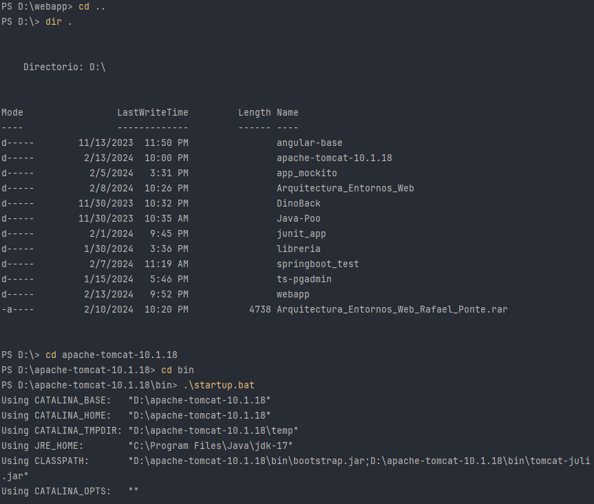

1. Descargar apache TomCat
2. Pega archivo en jdk's
3. Abrir carpeta conf/tomcat-users.x.xml
4. user username="admin" password="12345" roles="admin,manager-gui,manager-script"/>
5. En Intellij Ide: Edit configuration.
6. Agregar configuracion con maven
7. Nombre Tomcat7, en run: tomcat7:redeploy
6. Configurar variable JAVA_HOME como Jdk, no como Jre

